<div align="center">

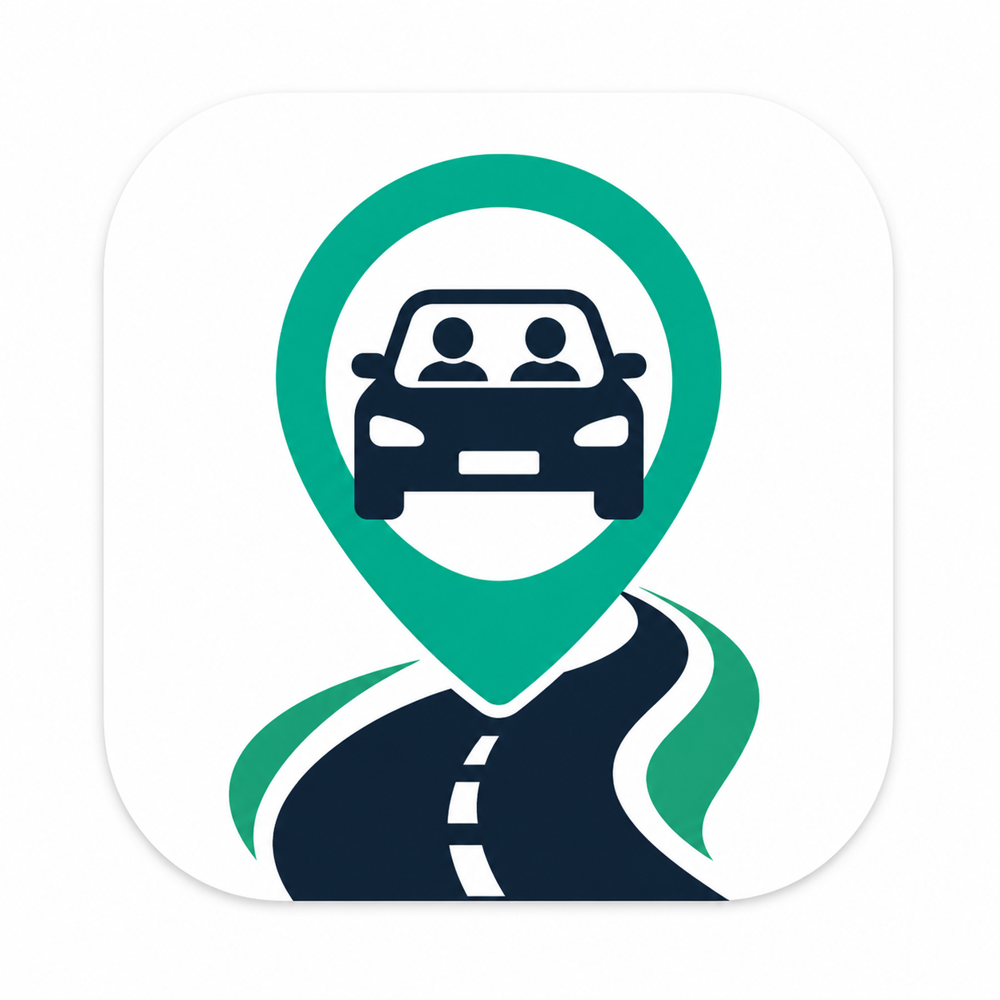

# Campus Ride

**University-exclusive ride sharing for [Leading University](https://lus.ac.bd/), Sylhet**

[](https://flutter.dev)
[](https://supabase.com)
[](https://dart.dev)
[](LICENSE)

*Developed as a Third Year Defense Project*


</div>

---

## What is CampusRide?

CampusRide is a mobile app that lets **Leading University students share rides with each other** — and only with each other. Access is locked to `@lus.ac.bd` university emails, so every person on the platform is a verified student.

Students who have empty seats in their vehicle post a **Ride Offer**. Students who need a ride post a **Ride Request**. Ride offers, requests, notifications, and chat all update in real time. Coordination happens with a phone call. No payments, no complicated matching.

---

## Screenshots

| Login | Register | OTP Verification |
|:---:|:---:|:---:|
| 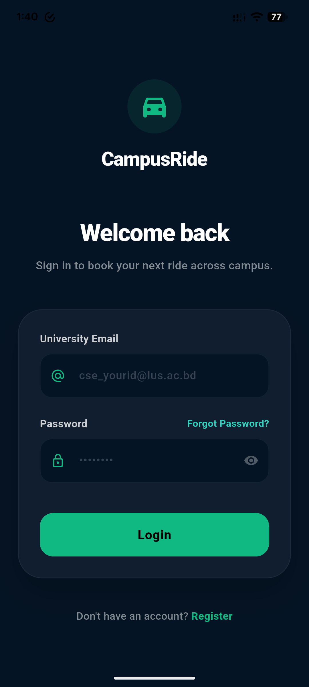 | 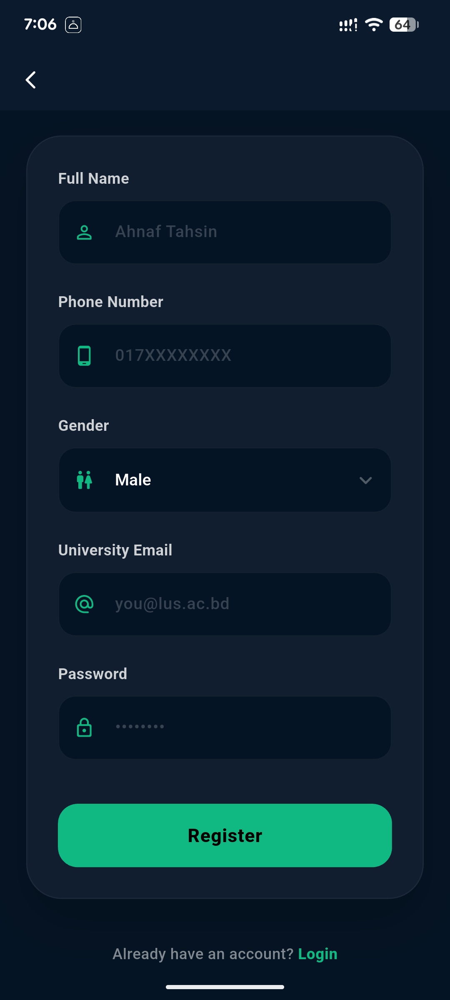 | 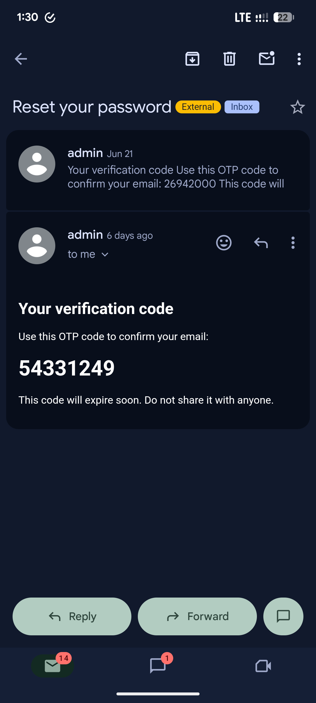 |
| *Login Screen* | *Register Screen* | *OTP Verification* |

| Dashboard | Ride Detail | Leaderboard |
|:---:|:---:|:---:|
| 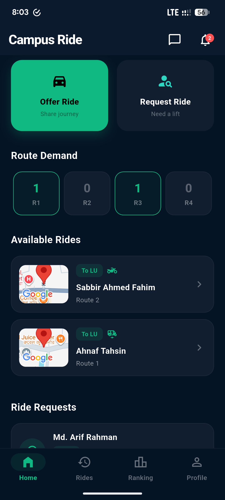 | 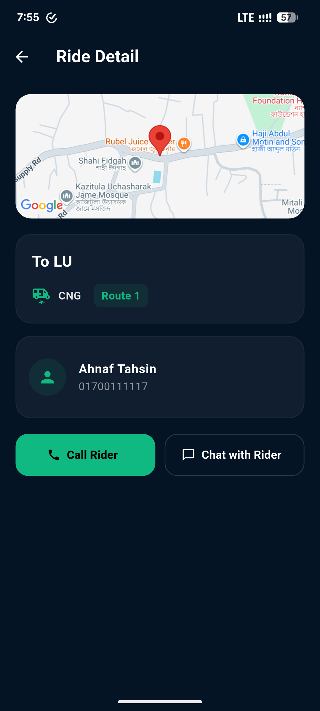 | 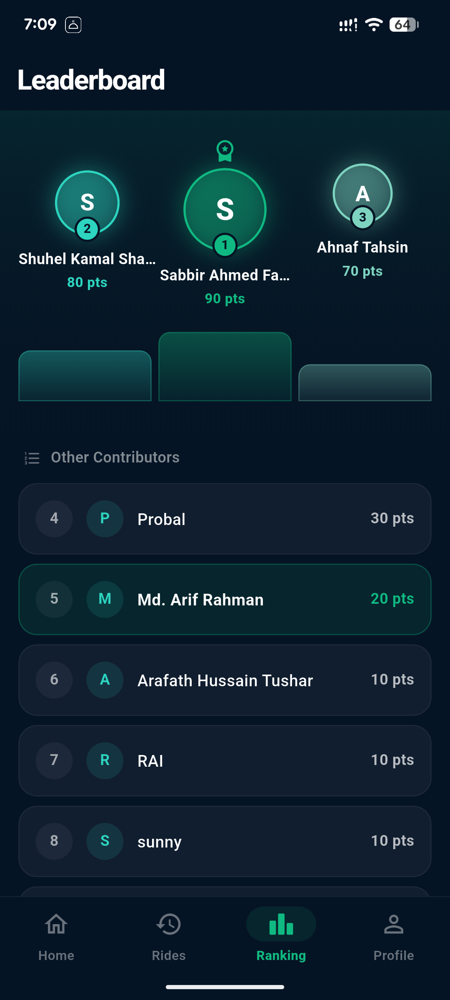 |
| *Home Dashboard* | *Ride Detail* | *Contribution Leaderboard* |

| Chat | Notification Inbox | Profile |
|:---:|:---:|:---:|
| 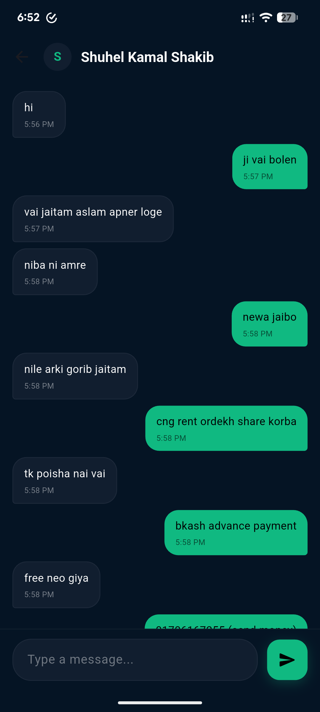 | 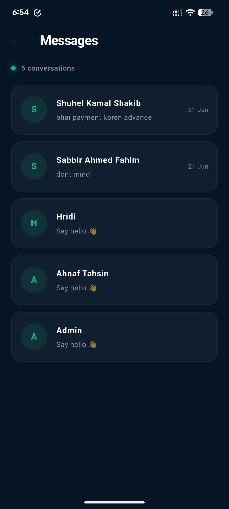 | 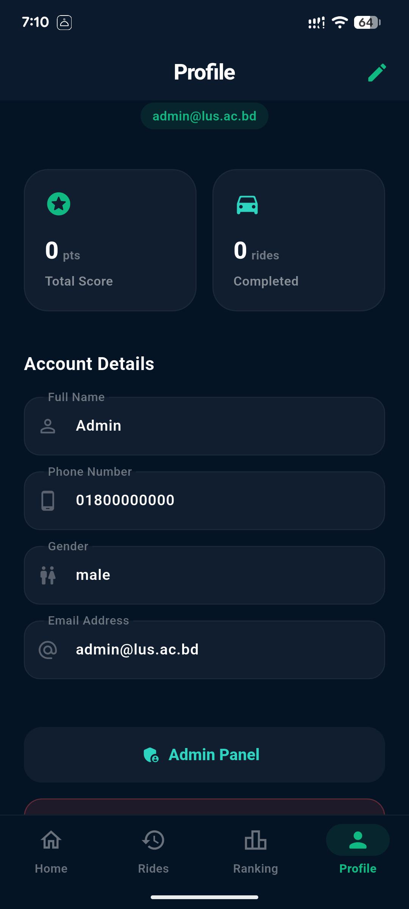 |
| *In-App Chat* | *Notification Inbox* | *Profile Screen* |

| Admin Panel | Notification Bell | |
|:---:|:---:|:---:|
| 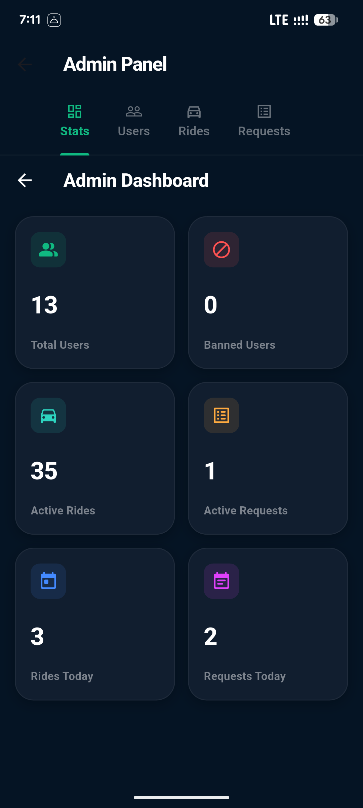 | 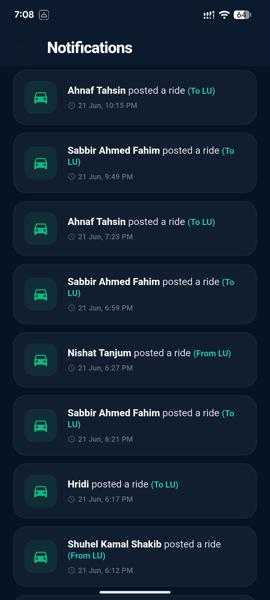 | |
| *Admin Dashboard* | *Notification* | |

---

## Download

**Latest APK:** [Download CampusRide v1.0.0](https://github.com/sabbirahmedfahim/campusride/releases)

> Android only. You may need to enable **Install unknown apps** to install the APK.

## Features

### Authentication
- Registration locked to `@lus.ac.bd` university email addresses
- Verified by Regex on the client **and** a Postgres trigger + `CHECK` constraint server-side — the database will reject any non-LU email regardless of what the client sends
- 8-digit OTP email verification on signup; standard email + password login after that

### Ride Offers
- Post a ride with GPS-detected pickup location (no manual pin placement — ever), vehicle type (CNG / Car / Bike), direction (From LU / To LU), and an optional route tag
- New ride offers are synchronized across all connected users via Supabase Realtime
- Riders manage their own ride with **Booked** and **Cancel** buttons directly on the dashboard

### Ride Requests
- Students needing transport post a request with their GPS location and preferred routes (multi-select, at least one required)
- **Route Demand Summary** on the dashboard shows live counts per route (e.g. *Route 1 — 12 requests*), helping riders identify which routes currently have the most unmet demand

### Real-Time Updates
- Ride feeds, ride requests, route demand summary, latest rides, notifications, and chat are all synchronized in real time via Supabase Realtime WebSocket subscriptions

### In-App Chat
- 1-to-1 messaging between any two students
- Chat icon accessible from the top navigation bar alongside the notification bell
- Conversations are identified by a canonical user-pair (the smaller UUID is always `user_a`) so duplicates are impossible at the database level

### Notifications
- In-app notification bell with unread badge count
- A notification is sent to every student (except the poster) whenever a new ride is offered
- Opening the notification inbox marks all unread notifications as read

### Contribution Leaderboard
- Top 50 contributors ranked by score — **+10 points** per successfully booked ride
- The first-ranked user is visually highlighted with a crown icon
- If the current user is outside the top 50, their rank and score are displayed separately below the list
- Tie-breaking: same score → whoever reached it **earliest** ranks higher

### Ride Cooldown System
- **30-minute cooldown** after any deliberate terminal action (Booked or Cancelled) — on both Ride Offers and Ride Requests
- Countdown shown on the disabled button so users know exactly when they can post again
- Rides auto-expire after 30 minutes via `pg_cron` if no action is taken; expiry does **not** trigger the cooldown

### Admin Panel
- Stat cards: Total Users, Banned Users, Active Rides, Total Rides, Active Requests, Total Requests
- User management: search, block/unblock with confirmation dialog
- Force-cancel any active ride or request without triggering the rider's cooldown
- Only accounts with `is_admin = TRUE` can access the admin panel; the entry point is not rendered for regular users

---

## Tech Stack

| Layer | Technology |
|---|---|
| Mobile | Flutter (Dart) — iOS & Android |
| Backend & Database | Supabase (PostgreSQL) |
| Auth | Supabase Auth — email/password + OTP verification |
| Real-time | Supabase Realtime — WebSocket subscriptions |
| Location | `geolocator` package — GPS only, no interactive map SDK |
| Map Preview | Google Maps (read-only preview; tapping opens Google Maps externally) |
| State Management | Provider |
| Scheduled Jobs | `pg_cron` — ride and request auto-expiry every 5 minutes |
| Server Logic | Postgres triggers — profile creation, score tracking, notifications, chat metadata |

---

## Project Structure

```
lib/
├── api/                    # All Supabase / backend calls
│   ├── admin_api.dart
│   ├── auth_api.dart
│   ├── chat_api.dart
│   ├── leaderboard_api.dart
│   ├── notification_api.dart
│   └── ride_api.dart
├── config/
│   └── supabase_config.dart
├── entities/               # Core data models
│   ├── app_user.dart
│   ├── chat_message.dart
│   ├── conversation.dart
│   ├── notification_item.dart
│   ├── ride.dart
│   └── ride_request.dart
├── pages/                  # All screens
│   ├── home_shell.dart
│   ├── dashboard_screen.dart
│   ├── offer_ride_screen.dart
│   ├── request_ride_screen.dart
│   ├── ride_detail_screen.dart
│   ├── ride_history_screen.dart
│   ├── leaderboard_screen.dart
│   ├── chat_inbox_screen.dart
│   ├── chat_screen.dart
│   ├── notification_inbox_screen.dart
│   ├── profile_screen.dart
│   ├── admin_shell.dart
│   └── ...                 # auth, splash, admin screens
├── providers/              # App state (Provider)
│   ├── auth_provider.dart
│   ├── ride_provider.dart
│   ├── chat_provider.dart
│   └── ...
└── widgets/                # Reusable UI components
    ├── ride_card.dart
    ├── ride_request_card.dart
    ├── leaderboard_row.dart
    ├── map_thumbnail.dart
    └── ...
```

---

## Getting Started

### Prerequisites

- Flutter SDK `>=3.0.0`
- Dart SDK `>=3.0.0`
- Android minSdk `23` (required by `geolocator`)
- A Supabase project with the schema applied (see [Database Setup](#database-setup))

### Installation

```bash
# 1. Clone the repo
git clone https://github.com/your-username/campusride.git
cd campusride

# 2. Install dependencies
flutter pub get

# 3. Run on a connected device or emulator
flutter run
```

> The Supabase URL and anon key are already configured in `lib/config/supabase_config.dart` and point to the project backend.

### Build for Android

```bash
flutter build apk --release
# Output: build/app/outputs/flutter-apk/app-release.apk
```

---

## Database Setup

Run the SQL migrations in the following order in the Supabase SQL Editor:

| # | Section | What it creates |
|---|---|---|
| 1 | Core schema | `users`, `rides`, `notifications` tables, triggers, RLS, `pg_cron` expiry job, leaderboard queries |
| 2 | In-app chat | `conversations`, `messages` tables, triggers, RLS, Realtime publication |
| 3 | Ride requests | `ride_requests` table, terminal-state trigger, `pg_cron` expiry job, RLS |
| 4 | Admin panel | `is_admin` / `is_banned` columns, `is_admin()` helper function, admin RLS policies |

Full SQL for all four sections is documented in the [project documentation](docs/project-documentation.md).

To grant admin access to a user after setup:
```sql
UPDATE public.users SET is_admin = TRUE WHERE email = 'admin@lus.ac.bd';
```

---

## How It Works

### Ride Lifecycle

```
Offered ──► Booked            (+10 pts, 30-min cooldown starts)
        └──► Cancelled        (no pts,  30-min cooldown starts)
        └──► Expired          (no pts,  no cooldown — auto after 30 min)
        └──► Force-Cancelled  (Admin — no pts, no cooldown for rider)
```

### Location — GPS Only

Pickup locations are obtained only from the device's current GPS position. Manual pin placement, typed coordinates, and cached locations are intentionally not supported. If GPS acquisition fails, ride creation is blocked until a valid location is obtained. The `pickup_lat` and `pickup_lng` columns are `NOT NULL` in the database, so an insert with null coordinates fails at the database level too.

### Notifications

Only one event triggers a notification: a new ride is posted. A PostgreSQL trigger creates notification records for all users except the rider whenever a new ride is inserted. These are delivered in real time via Supabase Realtime to connected clients.

### Leaderboard Scoring

Every time a ride's status transitions from `offered` → `booked`, a Postgres trigger increments `total_score` by 10, increments `rides_completed`, and timestamps `score_achieved_at` on the rider's user row. The leaderboard query is a plain indexed `SELECT` with no joins:

```sql
SELECT id, full_name, total_score, score_achieved_at
FROM public.users
WHERE rides_completed >= 1
ORDER BY total_score DESC, score_achieved_at ASC
LIMIT 50;
```

---

## Navigation

Four persistent bottom-nav tabs:

| Tab | Screen | Key Content |
|---|---|---|
| Home | Dashboard | Active rides, active requests, route demand summary, latest 10 completed rides, offer/request buttons |
| Rides | Ride History | All rides the current user offered that reached Booked or Cancelled state |
| Leaderboard | Rankings | Top 50 contributors by score; current user always visible |
| Profile | Profile | Edit name/phone; admin panel entry (admins only); logout |

The notification inbox, chat, ride detail, offer/request flows, and admin panel all push on top of the current tab and return on back navigation.

---

## Security

- **Email domain** — enforced by a Postgres `CHECK` constraint and a trigger. Client-side Regex validation provides immediate feedback, while the database constraints enforce the rule.
- **Row-Level Security** — all tables have RLS enabled. Users can only read/write their own data where appropriate; rides and requests are readable by all authenticated users.
- **Admin actions** — protected by a `SECURITY DEFINER` SQL function `is_admin()`. Admin RLS policies are additive, sitting alongside user-scoped policies.
- **Ban enforcement** — handled client-side immediately after `signInWithPassword`. If `is_banned = TRUE`, the app calls `signOut()` before populating any state.
- **Anon key** — safe to ship in the client. RLS policies are the real access gatekeeper.

---

## Roadmap (Phase 2)

- [ ] Ride request workflow — passengers can request a seat on an active Ride Offer. Riders receive an in-app notification and can accept or reject requests. Accepted requests automatically complete the ride and award leaderboard points, replacing the manual **Booked** action when requests exist.
- [ ] Geofence validation — validate ride direction using GPS coordinates. **From University** rides can only be posted within a predefined radius of the university, while **To University** rides can only be posted from outside that radius. Ride creation will also be restricted to locations within the supported Sylhet service area.
- [ ] Notification preferences — allow users to customize ride notifications by route and gender, so they only receive notifications matching their selected preferences.
- [ ] Push notifications via Firebase Cloud Messaging
- [ ] Post-ride rating and review system
- [ ] Female-only ride filter
- [ ] Direction and route filter chips on the dashboard
- [ ] Report user / abuse flagging
- [ ] Seasonal leaderboard resets (weekly / monthly)
- [ ] Route geofence auto-detection
- [ ] Production readiness — prepare the application for real-world deployment by improving reliability, performance, security, error handling, monitoring, testing, and overall user experience.

---

## License

This project is licensed under the MIT License. See [LICENSE](LICENSE) for details.

---

<div align="center">

Developed as a Third Year Defense Project
Department of Computer Science & Engineering
Leading University, Sylhet

</div>