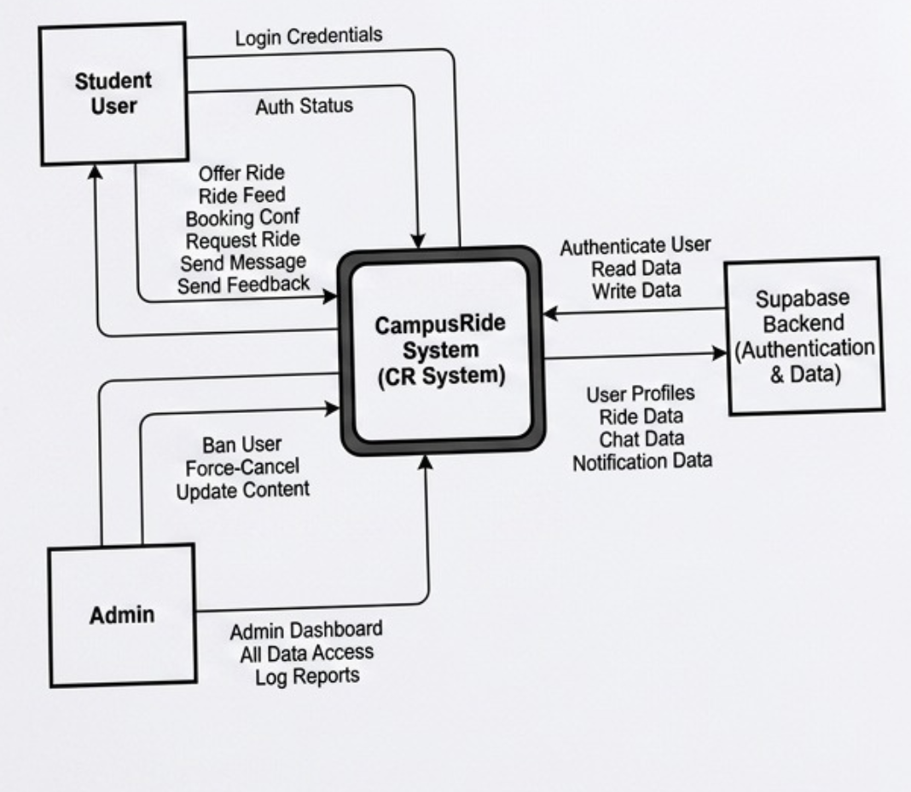
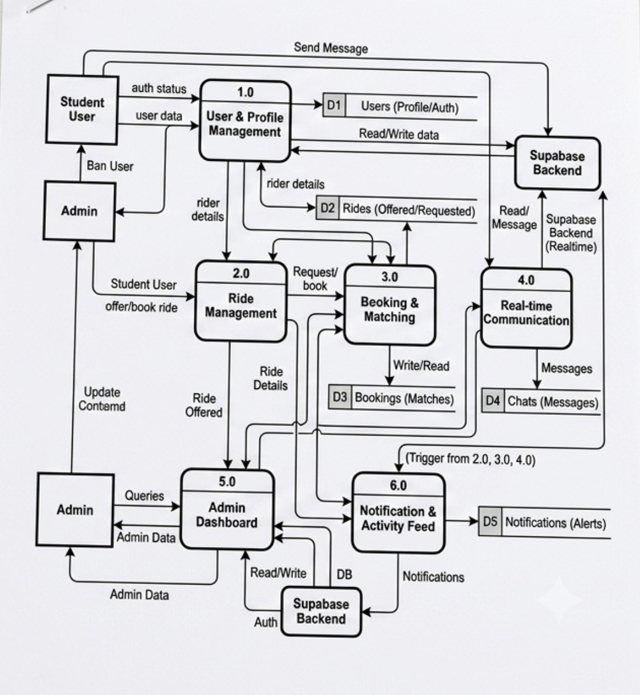
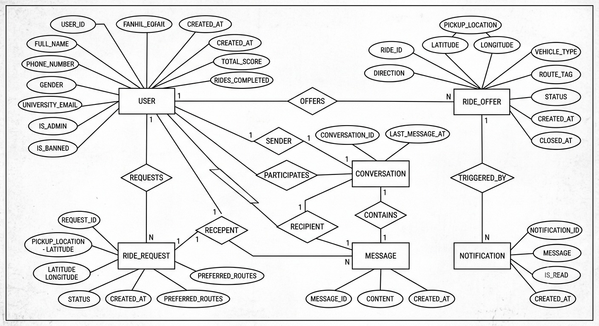
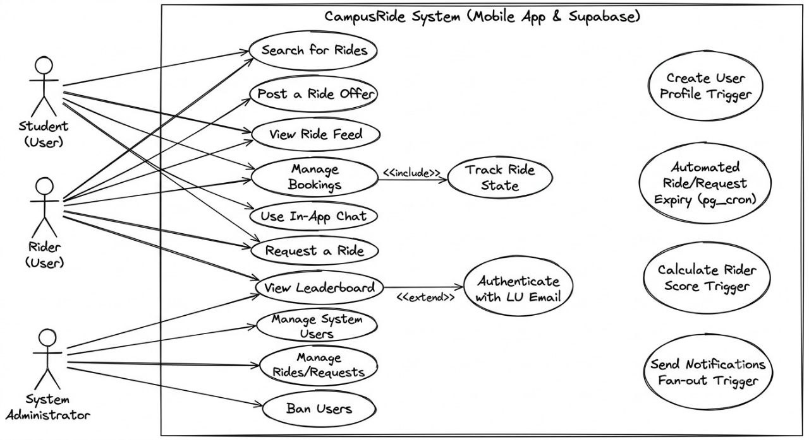
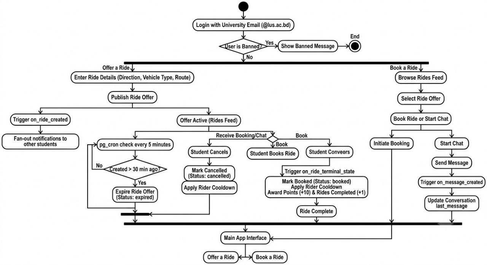

# CampusRide
## University Ride Sharing Application
## Full Project Documentation

**Third Year Defense Project**
Leading University, Sylhet
Technology: Flutter + Supabase
Version 10

<!-- Page 1 -->

---

## Table of Contents

1. Project Overview
2. User Roles
3. Authentication & Registration
4. System Models
5. Ride Lifecycle
6. Offering a Ride
7. Requesting a Ride
8. Passenger Interaction
9. In-App Chat
10. Notification System
11. Admin Panel
12. Splash Screen
13. Bottom Navigation Structure
14. Dashboard (Home Tab)
15. Ride History (Rides Tab)
16. Contribution Leaderboard
17. Database Schema
18. Technology Stack
19. Screen Map
20. Codebase Structure
21. Essentials & Technology Stack (GPS, Maps, Supabase)
22. Platform Build & Run Requirements
23. Database SQL (Complete Reference)
24. Key Design Decisions & Defense Talking Points
25. Future Work (Phase 2+)

<!-- Page 2 -->

---

## 1. Project Overview

CampusRide is a Flutter-based mobile application backed by Supabase that enables ride sharing exclusively among students of Leading University, Sylhet. The platform is access-controlled by the university email domain (@lus.ac.bd), ensuring that only enrolled students can participate. Students who have a reserved vehicle or their own transport can offer empty seats to fellow students commuting on the same route, reducing travel cost and effort for everyone involved.

### 1.1 Problem Statement

Students of Leading University rely on personal or shared transport to commute daily. Many students travel on the same four university routes yet have no structured way to coordinate rides. The result is wasted seats, increased individual travel cost, and unnecessary traffic. CampusRide solves this by providing a lightweight, real-time coordination layer that is trusted (university-email-gated) and simple enough to be used daily.

### 1.2 Goals

- Provide a university-locked ride sharing platform with zero external users.
- Make ride discovery real-time so students see live offers, not stale listings.
- Keep coordination simple: no complex matching algorithms, no payments, no rating systems in Phase 1.
- Build an abuse-resistant system through university email domain verification, cancellation throttling, and structured ride lifecycle.
- Recognize and motivate active contributors through a transparent, gamified leaderboard.
- Provide a minimalistic admin panel for user management and platform oversight.
- Lay a documented, extensible foundation for Phase 2 features (in-app chat, ratings, route geofencing).

### 1.3 Scope

**In Scope (Phase 1)**

- University email + password registration with email confirmation
- Ride offer with location pin + vehicle type + optional route tag
- Real-time ride feed on dashboard
- In-app notifications for ride offered events only
- Ride Request feature with route demand summary
- 1-to-1 in-app chat between users
- Ride lifecycle state machine
- Latest Rides feed (max. 10, all users, on Dashboard)
- Ride History (own rides only — Rides tab)
- Contribution Leaderboard (top 50, score-based)
- 4-tab bottom navigation (Home, Rides, Leaderboard, Profile)

<!-- Page 3 -->

- Admin panel (user management, ban system, platform oversight)

**Roadmap (Phase 2)**

The features below are planned extensions beyond the current release and are documented in full in Section 25 (Future Work).

- Ride request workflow on specific ride offers, with rider accept/reject and automatic completion
- Geofence validation for GPS-based ride creation
- Notification preferences by route and gender
- Push notifications via Firebase Cloud Messaging
- Post-ride rating and review system
- Female-only ride filter
- Direction and route filter chips on the dashboard
- Report user / abuse flagging
- Seasonal leaderboard resets
- Automatic route detection based on GPS location
- Production readiness hardening

---

## 2. User Roles

CampusRide has two account types. Every registered student is a standard User by default. An Admin is a designated account with elevated privileges for platform management. The role of Rider is a temporary status, not a permanent account type — any user can become a Rider when they post an active ride, and they revert to a regular User when the ride ends.

| Role | Description |
|------|-------------|
| User (default) | Browsing the ride feed, viewing ride details, contacting riders via call. Can receive in-app notifications, view the Latest Rides feed, view their own Ride History, and view the Leaderboard. |
| Rider (temporary) | A User who has posted an active ride. Cannot post another ride while their ride is active. Role is released when the ride reaches a terminal state. |
| Admin | A designated user with is_admin = TRUE in the database. Has access to the Admin Panel for viewing platform statistics, managing users (block/unblock), and force-cancelling rides or requests. Admin status is granted manually via SQL. |

A Rider cannot simultaneously be in a passive passenger role. Once the ride reaches a terminal state (Booked or Cancelled), their role resets and they can offer or join rides again.

---

## 3. Authentication & Registration

### 3.1 Registration Flow

<!-- Page 4 -->

Registration uses Supabase Auth with OTP-based email verification. When a user submits the registration form, Supabase Auth creates the account and immediately sends an 8-digit OTP to the provided university email address.

- User enters name, phone number, gender, university email, and password on the Register Screen.
- Email format is validated against a Regex pattern on the client for instant UI feedback, confirming it matches the @lus.ac.bd pattern.
- Email domain is independently re-validated server-side (Postgres trigger + DB CHECK constraint) before any row is written. This is the real gatekeeper — the client-side Regex is convenience only and is never trusted alone.
- Password is checked against a minimum-strength rule (8+ characters) on the client for instant feedback. Supabase Auth's password policy is the real gatekeeper.
- If the email format and password are valid, Supabase Auth's signUp() is called. A corresponding profile row in public.users is created automatically via a Postgres trigger (handle_new_user on auth.users INSERT).
- Supabase Auth immediately sends an 8-digit OTP to the university email address.
- The app navigates to the OTP Verification Screen. The user cannot log in yet — the account is not activated until OTP verification succeeds.
- The user enters the 8-digit OTP in the app. The app verifies it using verifyOTP with OtpType.signup. On success, the account is activated and a session is created automatically.
- Once verified, the user is fully registered and lands on the Home dashboard.

Implementation note: Enable OTP-based email confirmation in Supabase Auth settings. Set OTP length to 8 digits in the Supabase dashboard. Email templates must use {{ .Token }} to display the OTP code. OTP expiry should be set to a short window (e.g., 10–15 minutes) in Auth settings.

### 3.2 Account States

| State | Meaning | Can Log In? |
|-------|---------|-------------|
| Unverified | Account created in auth.users and public.users immediately after signUp(). OTP sent to email. Account not yet active. | No |
| Verified | User entered the correct 8-digit OTP via verifyOTP(OtpType.signup). Session created. Account active. | Yes |
| Banned | Admin has set is_banned = TRUE on the user's profile. The app checks this flag after sign-in and immediately signs the user out. | No |
| OTP Expired | OTP window elapsed without verification. Account remains Unverified; user must request a new OTP. | No |

### 3.3 Profile Data Collected at Registration

| Field | Notes |
|-------|-------|
| Full Name | Displayed on ride cards visible to other users |

<!-- Page 5 -->

| Field | Notes |
|-------|-------|
| Phone Number | Shared with other students when a ride is active (tap to call) |
| Gender | |
| University Email | @lus.ac.bd only, validated by Regex (client) and a Postgres trigger + DB CHECK (server). 8-digit OTP sent here at signup for verification. |
| Password | Minimum 8 characters. Hashed and stored entirely by Supabase Auth (auth.users) — never written to the public users table. |

### 3.4 Login

Login is email + password only. Supabase Auth verifies credentials via signInWithPassword and creates a session directly — no OTP step is required for login.

- Returning users log in with university email + password via Supabase Auth (signInWithPassword).
- After a successful sign-in, the app fetches the user's profile and checks the is_banned flag. If the user is banned, the app immediately calls signOut() and surfaces an appropriate error message.
- If the account is unverified, Supabase Auth returns an error. The app surfaces a friendly message with a "Resend OTP" action.
- On success, sessions are managed by Supabase; JWT tokens are stored securely on device.

### 3.5 Password Recovery

Password recovery uses a separate OTP flow. The user enters their registered university email and requests a reset code. Supabase sends an 8-digit recovery OTP to that address.

- User taps "Forgot Password" on the Login Screen and enters their university email.
- The app calls resetPasswordForEmail. Supabase sends an 8-digit recovery OTP to the email.
- The user is navigated to the Password Reset Screen, where they enter the OTP and a new password.
- The app verifies the OTP using verifyOTP with OtpType.recovery, then updates the password using updateUser.
- On success, the user is returned to the Login Screen to sign in with their new password.

Implementation note: The recovery OTP uses the same 8-digit length configured in the Supabase dashboard. The email template for password recovery must also use {{ .Token }}. No separate backend endpoint is needed — all flows are handled through Supabase Auth's built-in SDK methods.

<!-- Page 6 -->

---

## 4. System Models

This section presents the structural and behavioral models used to design CampusRide: the data flow diagrams (context and Level 1), the entity-relationship diagram, the use case diagram, and the primary activity diagram covering the offer and booking flows. These models were produced during the design phase and guided the database schema and screen flows described in the remainder of this document.

### 4.1 Data Flow Diagram — Context Level (DFD 0)

The context-level diagram treats CampusRide as a single process exchanging data with three external entities: the Student User, the Admin, and the Supabase Backend. It establishes the system boundary before the Level 1 diagram decomposes internal processing.



*Figure 4.1 — DFD Level 0 (Context Diagram)*

### 4.2 Data Flow Diagram — Level 1 (DFD 1)

The Level 1 diagram decomposes the CampusRide System into six processes: User & Profile Management (1.0), Ride Management (2.0), Booking & Matching (3.0), Real-time Communication (4.0), Admin Dashboard (5.0), and Notification & Activity Feed (6.0). Each process reads from or writes to one of five data stores — Users, Rides, Bookings, Chats, and Notifications — all persisted in the Supabase backend.

<!-- Page 7 -->



*Figure 4.2 — DFD Level 1*

### 4.3 Entity-Relationship Diagram

The ER diagram models six core entities — USER, RIDE_OFFER, RIDE_REQUEST, CONVERSATION, MESSAGE, and NOTIFICATION — and the relationships that connect them. A USER offers many RIDE_OFFER rows and requests many RIDE_REQUEST rows. Two users participate in a CONVERSATION (modeled through the SENDER, PARTICIPATES, and RECIPIENT relationships), and a CONVERSATION contains many MESSAGE rows. A RIDE_OFFER triggers NOTIFICATION rows for every other user through the TRIGGERED_BY relationship. This conceptual model maps directly onto the physical schema described in Section 17.

<!-- Page 8 -->




*Figure 4.3 — Entity-Relationship Diagram*

### 4.4 Use Case Diagram

Three actors interact with CampusRide: the Student (User), the Rider (User) — a temporary role assumed by any student while their ride is active — and the System Administrator. The diagram also surfaces four backend-triggered behaviors that are not actor-initiated but are essential to the system's operation: profile creation on signup, automated ride/request expiry via pg_cron, rider score calculation, and the notification fan-out trigger.

<!-- Page 9 -->



*Figure 4.4 — Use Case Diagram*

### 4.5 Activity Diagram — Offer & Booking Flow

The activity diagram traces the two primary student-facing flows after login and the ban check: offering a ride and booking a ride. The left branch follows a posted ride offer through its 30-minute expiry window, monitored by a pg_cron check every five minutes, and through cancellation or booking. The right branch follows a passenger browsing the ride feed through to booking or starting a chat with the rider, with each path triggering the corresponding database trigger (on_ride_terminal_state or on_message_created).



*Figure 4.5 — Activity Diagram (Offer a Ride / Book a Ride)*

<!-- Page 10 -->

---

## 5. Ride Lifecycle

### 5.1 State Machine

Every ride moves through the following states. No state can be skipped.

| State | Triggered By | Effect |
|-------|-------------|--------|
| Offered | Rider posts ride | Ride appears on all eligible dashboards. Notification sent to all users. Expiration calculated from created_at. |
| Booked | Rider taps Booked | Ride marked complete. Removed from active feed via real-time update. Appears in the Latest Rides feed (Dashboard) and in the rider's own Ride History (Rides tab). Rider's score increases by 10 points. No notification sent. Initiates 30-minute cooldown. |
| Cancelled | Rider taps Cancel | Ride removed from feed via real-time update. Appears in the rider's own Ride History (Rides tab) only — does NOT appear in the Latest Rides feed and does NOT award points. No notification sent. Initiates 30-minute cooldown. |
| Expired | System (pg_cron job) | Ride automatically marked expired after 30 minutes from created_at. Removed from active feed. Does not appear in Ride History, Latest Rides, or the leaderboard. Does NOT trigger cooldown. |
| Force-Cancelled (Admin) | Admin taps Force Cancel in Admin Panel | Ride status set to 'cancelled' by an admin. Removed from active feed. Does not award points or appear in Latest Rides. Does not trigger cooldown for the rider. |

### 5.2 Post-Ride Cooldown System

After a rider marks a ride as Booked or Cancelled, they are subject to a 30-minute cooldown. During this period, the Offer Ride button is disabled and shows a countdown message (e.g., "Available in 14 min") so the rider knows exactly when they can post again.

The cooldown is a simple timestamp check: last_ride_action_at is recorded on the users table at the moment of any terminal action. The user cannot post a new ride until NOW() > last_ride_action_at + INTERVAL '30 minutes'.

Key properties of this system:

- Stateless — no counters, no midnight reset jobs.
- Expired rides do NOT trigger the cooldown (expiry is not a deliberate user action).
- No daily limit. A user who cancels can wait 30 minutes and post again.
- Trade-off: users cannot rapidly repost if they made an error, but overall ride availability is more stable.

The cooldown applies globally across both Ride Offers and Ride Requests. When a user completes or cancels either a Ride Offer or a Ride Request, the same shared 30-minute cooldown period begins, preventing the creation of any new offer or request during that window.

<!-- Page 11 -->

---

## 6. Offering a Ride

### 6.1 Pre-conditions

- User is logged in (email confirmed) and online.
- User does not already have an active ride posted.
- User is not currently within the 30-minute cooldown period.

### 6.2 Direction Selection (Pre-offer Step)

When the user taps the Offer Ride button, a modal appears first with two tappable options:

- **From Leading University** — rider is departing from campus heading elsewhere.
- **To Leading University** — rider is heading toward campus from another location.

This direction is stored with the ride and displayed on ride cards to help passengers quickly identify relevant rides.

### 6.3 Ride Offer Form

| Field | Required | Details |
|-------|----------|---------|
| Current Location | Mandatory | Auto-detected via device GPS only. No manual pin placement, no map drag, no tap-to-set, under any circumstance. See 6.3.1 for full behavior. |
| Direction | Mandatory (pre-selected) | Pre-filled from Step 6.2. Not editable on this screen. |
| Vehicle Type | Mandatory | One of: CNG, Car, Bike. |
| Route Tag | Optional | One of: Route 1, 2, 3, 4. Self-declared. Not geo-validated. Leaving it unset is valid. |

### 6.3.1 Location Acquisition Behavior (GPS-Only — Hard Rule)

This is a hard, non-negotiable rule for the entire app: the rider's pickup location is captured exclusively via the device's live GPS reading. There is no manual alternative, ever, under any condition.

Explicitly forbidden, in all cases:

- Tapping a point on a map to set location.
- Dragging or adjusting a pin after it is placed.
- Typing an address or coordinates manually.
- Any cached or last-known location used as a substitute for a fresh GPS read.

Flow on the Offer Ride screen:

- On screen entry, the app immediately requests a fresh GPS fix (not the device's last cached location).

<!-- Page 12 -->

- While acquiring, the UI shows a loading state ("Detecting your location…") and the Post Ride button is disabled.
- On success, the form displays a locked map preview centered on the detected coordinates with a marker, plus the raw latitude/longitude. Tapping the map preview opens the exact coordinates in the Google Maps app or browser via an external intent — there is no interactive map widget on this screen. The Post Ride button becomes enabled only at this point.
- On failure (location services disabled, permission denied, permission denied forever, or GPS timeout), the ride offer is blocked entirely. The Post Ride button remains disabled and there is no fallback path of any kind. A clear, specific error message is shown, together with a Retry action that re-triggers GPS acquisition from scratch.
- pickup_lat and pickup_lng are NOT NULL columns in the database — the insert is structurally guaranteed to carry real GPS coordinates or fail outright, never a null or placeholder value.

### 6.4 Post-Offer

- Ride inserted into database with status = 'offered'.
- In-app notification dispatched to all users (broadcast). A Postgres trigger on rides INSERT creates one notification row per user in the notifications table.
- Ride card appears on all eligible dashboards in real-time.
- Rider's dashboard shows two action buttons: Booked and Cancel Ride.

---

## 7. Requesting a Ride

In addition to offering rides, students can create Ride Requests when they need transportation. The Ride Request feature follows the same overall workflow and restrictions as the Ride Offer feature, ensuring a consistent user experience throughout the application.

### 7.1 Creating a Ride Request

- A user may tap the Request Ride button from the Home dashboard.
- The app automatically detects the user's current location and displays a locked map preview. A Ride Request cannot be submitted unless the location is successfully obtained.
- The user must then select one or more preferred university routes.

Route selection rules:

- At least one route must be selected.
- Multiple routes may be selected.
- A user may select all four routes if willing to accept transportation through any route.
- Unlike Ride Offers, route selection is mandatory for Ride Requests.
- Once submitted, the request becomes visible to all users in real time.

### 7.2 Request Information Displayed

Each active Ride Request displays:

<!-- Page 13 -->

- Requester's name
- Current location preview (locked map, tappable to open in Google Maps)
- Selected routes
- Time of request

This allows riders to quickly understand where transportation demand currently exists.

### 7.3 Active Request Feed

The Home dashboard includes an Active Ride Requests section similar to the existing Active Ride Feed. All currently active requests are displayed in real time and automatically update when requests are created, completed, cancelled, or expired.

### 7.4 Route Demand Summary

A Route Demand section is displayed above the request feed. For each university route, the system shows how many active requests currently include that route. Example:

- Route 1 — 12 requests
- Route 2 — 8 requests
- Route 3 — 5 requests
- Route 4 — 9 requests

This provides riders with a quick overview of current transportation demand across the university routes.

### 7.5 Shared Activity Restriction

A user may have only one active transportation activity at a time. This means a user cannot:

- Have an active Ride Offer and an active Ride Request simultaneously.
- Create multiple active Ride Offers.
- Create multiple active Ride Requests.

The current activity must first reach a terminal state before another one can be created.

### 7.6 Ride Request Lifecycle

| Status | Triggered By | Effect |
|--------|-------------|--------|
| Requested | User submits request | Visible in the Active Requests feed in real time. Counted in the Route Demand summary. |
| Completed | Requester taps Complete | Request removed from active feed. Indicates the requester successfully found transportation. |
| Cancelled | Requester taps Cancel | Request withdrawn. Removed from active feed. Initiates 30-minute shared cooldown. |
| Expired | System (pg_cron job) | Automatically removed after 30 minutes if no action is taken. Does NOT trigger cooldown. |

<!-- Page 14 -->

| Status | Triggered By | Effect |
|--------|-------------|--------|
| Force-Cancelled (Admin) | Admin taps Force Cancel in Admin Panel | Request status set to 'cancelled' by an admin. Removed from active feed. |

### 7.7 Design Rationale

The Ride Request feature introduces demand visibility alongside the existing ride supply model. While Ride Offers allow students with available transportation to advertise empty seats, Ride Requests allow students seeking transportation to communicate their needs. Together, these two features provide a more balanced and informative ride-sharing ecosystem while preserving the simplicity-first design philosophy of CampusRide.

<!-- Page 15 -->

---

## 8. Passenger Interaction

Passengers have no in-app request or booking mechanism for Ride Offers. The interaction model is intentionally simple:

- Passenger sees a ride card on their dashboard.
- Passenger taps the card to view full details: direction, rider name, phone number, vehicle type, route tag, and map preview.
- Passenger calls the rider directly via their phone number to confirm interest.
- Rider confirms verbally, then taps Booked in the app to close the ride.

The phone-call method remains available even after in-app chat is introduced.

---

## 9. In-App Chat

CampusRide includes 1-to-1 in-app messaging, allowing any two users to communicate directly. The chat icon is accessible from the top navigation bar, alongside the notification bell.

### 9.1 Conversation Model

- Each conversation is uniquely identified by a pair of user IDs. The pair is stored in canonical order (user_a < user_b by UUID comparison) to ensure a pair can never be duplicated regardless of who initiates first.
- A new conversation row is created automatically the first time a user sends a message to another user, if no conversation between them already exists.
- The chat inbox (Chat Inbox Screen) lists all conversations the current user is a participant of, ordered by most recent message.
- Each conversation shows the other participant's name and the last message sent.

### 9.2 Messaging

- Messages are immutable in this version — no editing or deletion is supported.
- Message content must be non-empty (whitespace-only messages are rejected at the database level).
- New messages are delivered in real time via Supabase Realtime subscription on the messages table.
- The conversations table's last_message and last_message_at columns are updated automatically by a Postgres trigger whenever a new message is inserted.

### 9.3 Access Control

- A user can only read conversations they are a participant of.
- A user can only send messages as themselves, and only into conversations they participate in.
- No message editing or deletion is permitted from the client — these policies are absent by design.

<!-- Page 16 -->

---

## 10. Notification System

The notification system is intentionally minimal. Only one event type triggers a notification:

| Event | Recipients |
|-------|-----------|
| New ride posted (any route) | All users except the rider who posted it (broadcast) |

Ride Cancelled and Ride Booked events do NOT trigger notifications. Instead, the ride feed updates in real-time via Supabase Realtime subscription — when a ride is cancelled or booked, it simply disappears from the active feed automatically.

Phase 1 notifications are in-app only (no Firebase Cloud Messaging). When a ride is posted, a Postgres trigger on the rides table INSERT creates one notification row in the notifications table for every user except the rider themselves. These rows are delivered to connected clients via Supabase Realtime subscription. A notification bell/inbox is accessible from the top navigation bar.

The notification badge count shown on the bell icon reflects the number of unread notifications for the current user. When the user opens the notification inbox, all notification rows for that user are marked is_read = true in a single bulk UPDATE, and the badge resets to zero — no separate action is required.

---

## 11. Admin Panel

CampusRide includes a minimalistic admin panel for platform management. The admin panel is accessible only to users with is_admin = TRUE in the database. Admin status is granted manually via SQL and is never self-assignable.

### 11.1 Access

- The admin entry point is surfaced on the profile screen or home shell behind an if (currentUser.isAdmin) guard — it is invisible to regular users.
- The admin panel is a separate tab-based shell (AdminShell) layered on top of the main navigation, with four tabs: Dashboard, Users, Rides, and Requests.
- Banned users are blocked at sign-in: after a successful login, the app checks is_banned and immediately calls signOut() if true, displaying an error message to the user.

### 11.2 Dashboard

The admin dashboard displays six summary stat cards with pull-to-refresh:

- Total Users
- Banned Users
- Active Rides
- Rides Today
- Active Requests
- Requests Today

<!-- Page 17 -->

### 11.3 User Management

- Searchable list of all registered users.
- Each user row displays their name, email, and current ban status.
- Admin can block or unblock a user with a single tap. A confirmation dialog is shown before toggling.
- Blocking sets is_banned = TRUE on the user's row. The banned user is signed out the next time they attempt to log in.
- Admin accounts themselves cannot be banned via the admin panel.

### 11.4 Ride Management

- Displays all currently active rides (status = 'offered').
- Admin can force-cancel any active ride. Force-cancellation sets the ride status to 'cancelled' without triggering the rider's cooldown.

### 11.5 Request Management

- Displays all currently active ride requests (status = 'requested').
- Admin can force-cancel any active request. Force-cancellation sets the request status to 'cancelled' without triggering the requester's cooldown.

### 11.6 Security Model

The admin panel's Supabase access is governed by RLS policies and a SECURITY DEFINER helper function:

- **public.is_admin()** — a SQL function that returns TRUE if the current session user has is_admin = TRUE. Uses SECURITY DEFINER to read the users table without RLS interference.
- **users_admin_update policy** — allows an admin to UPDATE any user row (e.g., to set is_banned).
- **rides_admin_update policy** — allows an admin to UPDATE any ride row (e.g., to force-cancel).
- **requests_admin_update policy** — allows an admin to UPDATE any ride_request row (e.g., to force-cancel).

Admin status is granted by running the following SQL manually in the Supabase SQL Editor:

```sql
UPDATE public.users SET is_admin = TRUE WHERE email = 'admin@lus.ac.bd';
```

---

## 12. Splash Screen

The splash screen is shown immediately on app launch, before any other screen, while the app performs its initialization sequence. It is shown for exactly as long as initialization takes, with a short minimum display time so the logo does not flash imperceptibly on fast devices.

### 12.1 Initialization Sequence

- Display CampusRide logo and app name on a branded background.

<!-- Page 18 -->

- Initialize the Supabase client and restore any existing session from secure local storage.
- If a valid session exists, silently verify it is still valid (session not expired/revoked).
- Enforce a minimum splash duration of ~1.2 seconds so the logo is visibly readable even when initialization is instant.
- Route to the next screen based on the outcome (see 12.2).

### 12.2 Routing Decision

| Condition After Init | Destination |
|---------------------|------------|
| No session found | Login Screen |
| Valid session found, email confirmed, not banned | Home (Dashboard) — default tab of Bottom Navigation |
| Valid session found, user is banned | Login Screen (signed out, ban message shown) |
| Session expired / token invalid | Login Screen (session cleared) |

<!-- Page 19 -->

---

## 13. Bottom Navigation Structure

Once a user is authenticated, the app shell displays a persistent Bottom Navigation Bar with four tabs, left to right:

| # | Tab | Screen | Shows |
|---|-----|--------|-------|
| 1 | Home | Dashboard | Online status, Offer Ride button, Request Ride button, Active Ride Feed, Active Requests feed, Route Demand summary, Latest Rides feed, notification bell, chat icon. |
| 2 | Rides | Ride History | The logged-in user's own rides only — every ride they personally offered, in Booked or Cancelled state. |
| 3 | Leaderboard | Contribution Leaderboard | Top 50 contributors ranked by score, with the current user's own rank highlighted. |
| 4 | Profile | Profile / Settings | User's own profile info (name, phone, gender, email) with edit access for name and phone. Admin panel entry (visible to admins only). Logout option. |

The Bottom Navigation Bar is always visible across these four screens and persists tab state when switching tabs. The Notification Inbox, Chat screens, Ride Detail, Offer Ride flow, Request Ride flow, Direction Selection Modal, and Admin Panel are pushed on top of the current tab and return to the same tab on back navigation.

---

## 14. Dashboard (Home Tab)

### 14.1 Elements

| Element | Description |
|---------|-------------|
| Online Status Indicator | Green dot indicating the user is connected. Powered by Supabase Realtime Presence (optional, cosmetic). |
| Offer Ride Button | Prominent UI element. Opens direction selection modal, then ride offer flow. Disabled if user has an active ride/request or is within the 30-minute cooldown. When disabled due to cooldown, shows a countdown (e.g., "Available in 14 min"). |
| Request Ride Button | Opens the ride request flow directly. Disabled under the same shared cooldown and active-activity restrictions as Offer Ride. |
| Active Ride Feed | List of currently available ride offers. Each card shows: direction tag, rider name, vehicle type, route tag (if set), and map preview. Real-time updates via Supabase Realtime subscription. |
| Route Demand Summary | Displayed above the Active Requests feed. Shows the count of active requests per route (Route 1–4), updated in real time. |

<!-- Page 20 -->

| Element | Description |
|---------|-------------|
| Active Ride Requests Feed | List of currently active ride requests. Each card shows: requester name, location preview, selected routes, and time of request. Real-time updates via Supabase Realtime subscription. |
| Active Ride Management | When the logged-in user has an active ride (status = 'offered'), their own ride card shows two action buttons inline: Booked and Cancel Ride. |
| Latest Rides | Horizontal scroll section below the Active Ride Feed. Shows the most recent Booked rides completed by any user, capped at 10. Display-only. |
| Notification Bell | Opens in-app notification inbox. Shows unread count badge. Contains only ride_offered notifications. |
| Chat Icon | Opens the Chat Inbox Screen, listing all conversations the user participates in. |

### 14.2 Latest Rides Section — Details

- **Location:** same Dashboard (Home tab), positioned directly below the Active Ride Feed — not a separate tab.
- **Scope:** shows rides completed (status = 'booked') by all users, including the current user's own completed rides.
- **Limit:** hard-capped at the 10 most recently completed rides, ordered by closed_at DESC.
- Cancelled and Expired rides never appear here — only successfully Booked rides.
- Tapping a Latest Rides card does nothing — these cards are display-only and have no navigation.

Each Latest Rides card shows only lightweight, glanceable details:

- Rider's full name
- Direction (From LU / To LU)
- Vehicle type icon (CNG / Car / Bike)
- Relative time completed (e.g., "12m ago")

---

## 15. Ride History (Rides Tab)

Ride History shows every ride the logged-in user has personally offered that has reached a terminal state — both Booked and Cancelled rides.

### 15.1 What Counts as History

| Status | Included in Ride History? |
|--------|--------------------------|
| Booked | Yes — counted as a completed ride and contributes +10 points to the user's leaderboard score. |
| Cancelled | Yes — shown so the user has a full record, but does not contribute leaderboard points. |

<!-- Page 21 -->

| Status | Included in Ride History? |
|--------|--------------------------|
| Expired | No — an expired ride was never acted on by the rider. |
| Offered (still active) | No — only terminal-state rides appear in history; the active ride is shown on the Home dashboard instead. |

### 15.2 Ride History Card

Each card shows minimal, easy-to-scan details:

- Date (the date the ride was created, e.g., "19 Jun 2026")
- Direction (From LU / To LU)
- A small status tag (Booked / Cancelled)

List is ordered by closed_at DESC (most recent first). No pagination limit is required for Phase 1.

<!-- Page 22 -->

---

## 16. Contribution Leaderboard

The Leaderboard is accessible from the "Leaderboard" tab in the Bottom Navigation Bar. It is global and all-time (no periodic reset) for Phase 1.

### 16.1 Scoring Rules

- A user earns 10 points every time one of their offered rides reaches the Booked state.
- Cancelled and Expired rides award zero points.
- Scoring is all-time — there is no weekly/monthly reset in Phase 1.
- Minimum qualification: a user must have completed (Booked) at least 1 ride to appear on the leaderboard at all.

### 16.2 Display Rules

- Only the top 50 ranked users are displayed.
- The current user's own row is always highlighted (with a distinct background) wherever it appears in the visible top 50.
- If the current user is not in the top 50, a separate "sticky" row pinned below the list shows their own rank and score.
- 1st place receives special, visually rewarding treatment — gold accent, crown/trophy icon, and slightly larger card.

### 16.3 Tie-Breaking Rule

When two or more users have the same total score, the user who achieved that score earliest is ranked higher. This means whoever's most recent point-scoring ride (the one that brought them to their current total) happened earliest in time is ranked above a user who reached the same total later.

### 16.4 Leaderboard Row

| Rank | Display |
|------|---------|
| 1st | Gold-accented card, crown/trophy icon, name, total score, slightly elevated visual treatment. |
| 2nd – 50th | Standard row: rank number, name, total score. Current user's row gets a highlighted background regardless of rank. |
| Below 50th (if applicable) | Current user's row pinned at the bottom of the screen showing their actual rank and score, outside the top-50 list. |

---

## 17. Database Schema

### 17.1 Tables

<!-- Page 23 -->

#### users (extends Supabase auth.users)

| Column | Notes |
|--------|-------|
| id — UUID PK | References auth.users.id |
| full_name — TEXT NOT NULL | |
| phone — TEXT NOT NULL | |
| gender — TEXT NOT NULL | CHECK: 'male' \| 'female' |
| email — TEXT NOT NULL UNIQUE | Must end with @lus.ac.bd. Validated by Regex on the client and enforced by a Postgres trigger AND a DB CHECK constraint server-side. |
| is_admin — BOOLEAN NOT NULL DEFAULT FALSE | Grants access to the admin panel. Set manually via SQL. |
| is_banned — BOOLEAN NOT NULL DEFAULT FALSE | When TRUE, the user is blocked from logging in. Checked client-side after sign-in. |
| last_ride_action_at — TIMESTAMPTZ | Timestamp of last booked/cancelled action (offer or request). Used to enforce 30-minute shared cooldown. NULL if no action taken yet. |
| total_score — INT NOT NULL DEFAULT 0 | Denormalized leaderboard score. Incremented by 10 every time one of the user's rides transitions to 'booked'. |
| rides_completed — INT NOT NULL DEFAULT 0 | Denormalized count of the user's Booked rides. Used to determine leaderboard eligibility (>= 1). |
| score_achieved_at — TIMESTAMPTZ NULL | Timestamp of the ride that brought the user to their CURRENT total_score. Used as the leaderboard tie-breaker. |
| created_at — TIMESTAMPTZ | |

#### rides

| Column | Notes |
|--------|-------|
| id — UUID PK | |
| rider_id — UUID FK | References users.id |
| direction — TEXT NOT NULL | CHECK: 'from_lu' \| 'to_lu' |
| pickup_lat — DOUBLE PRECISION NOT NULL | Mandatory pickup location |
| pickup_lng — DOUBLE PRECISION NOT NULL | Mandatory pickup location |
| vehicle_type — TEXT NOT NULL | CHECK: 'cng' \| 'car' \| 'bike' |
| route — INT NULL | CHECK: route IS NULL OR route IN (1,2,3,4). Optional. NULL = no route tag. |
| status — TEXT NOT NULL | CHECK: 'offered' \| 'booked' \| 'cancelled' \| 'expired' |

<!-- Page 24 -->

| Column | Notes |
|--------|-------|
| created_at — TIMESTAMPTZ | Source of truth for 30-minute expiration window. |
| closed_at — TIMESTAMPTZ NULL | Set when ride reaches a terminal state. |

#### ride_requests

| Column | Notes |
|--------|-------|
| id — UUID PK | |
| requester_id — UUID FK | References users.id |
| direction — TEXT NOT NULL | CHECK: 'from_lu' \| 'to_lu' |
| pickup_lat — DOUBLE PRECISION NOT NULL | Mandatory pickup location |
| pickup_lng — DOUBLE PRECISION NOT NULL | Mandatory pickup location |
| routes — INT[] NOT NULL | Array of selected route numbers, e.g. {1,3}. At least one required. |
| status — TEXT NOT NULL | CHECK: 'requested' \| 'completed' \| 'cancelled' \| 'expired' |
| created_at — TIMESTAMPTZ | Source of truth for 30-minute expiration window. |
| closed_at — TIMESTAMPTZ NULL | Set when request reaches a terminal state. |

#### conversations

| Column | Notes |
|--------|-------|
| id — UUID PK | |
| user_a — UUID FK | References users.id. Always the smaller UUID (by text comparison) to prevent duplicate pairs. |
| user_b — UUID FK | References users.id. Always the larger UUID. |
| last_message — TEXT | Preview of the most recent message. Updated by trigger. |
| last_message_at — TIMESTAMPTZ | Timestamp of the most recent message. Used for inbox ordering. |
| created_at — TIMESTAMPTZ | |

#### messages

| Column | Notes |
|--------|-------|
| id — UUID PK | |
| conversation_id — UUID FK | References conversations.id |

<!-- Page 25 -->

| Column | Notes |
|--------|-------|
| sender_id — UUID FK | References users.id |
| content — TEXT NOT NULL | CHECK: char_length(trim(content)) > 0. Whitespace-only messages rejected at DB level. |
| created_at — TIMESTAMPTZ | |

#### notifications

| Column | Notes |
|--------|-------|
| id — UUID PK | |
| user_id — UUID FK | Recipient user. Indexed. |
| ride_id — UUID FK | Associated ride. |
| type — TEXT NOT NULL | Only 'ride_offered' stored. |
| is_read — BOOLEAN DEFAULT FALSE | |
| created_at — TIMESTAMPTZ | |

<!-- Page 26 -->

---

## 18. Technology Stack

| Layer | Technology |
|-------|-----------|
| Mobile Frontend | Flutter (Dart) — cross-platform iOS & Android |
| Backend & Database | Supabase (PostgreSQL) |
| Authentication | Supabase Auth — email + password, with native email confirmation enabled |
| Real-time | Supabase Realtime — WebSocket channels for live ride feed, requests feed, chat messages, Latest Rides updates, notification delivery, and optional presence indicator |
| Maps | No interactive map SDK. GPS capture via the geolocator package. Location preview via Flutter's built-in locked Google Maps widget (non-interactive preview; tapping opens Google Maps externally). |
| Serverless Logic | Postgres triggers for email domain validation, profile creation on signup, ride-terminal-state handling (score + cooldown), request-terminal-state handling, notification fan-out on ride INSERT, and chat last_message updates. pg_cron jobs for periodic ride and request expiration. |
| State Management | Provider (Flutter) |
| Navigation | Flutter's built-in bottom navigation (BottomNavigationBar or NavigationBar widget) with 4 persistent tabs |
| Notifications (Phase 1) | In-app only via Supabase Realtime. ride_offered events only. |
| Push Notifications (Phase 2) | Firebase Cloud Messaging (FCM) |

---

## 19. Screen Map

| Screen | Description |
|--------|-------------|
| Splash Screen | App logo + branded background, shown while the app initializes. Minimum ~1.2s display. Routes to Login or Home based on session state. |
| Register Screen | Name, phone, gender, email, password fields + Submit. On success, navigates to OTP Verification Screen. |
| OTP Verification Screen | Shown after registration submission. Prompts the user to enter the 8-digit OTP. Includes a "Resend OTP" action if the code expires. |
| Login Screen | Email + password fields → Submit. Surfaces a friendly error with a resend option if the account is unconfirmed. Checks is_banned after successful sign-in and blocks access if true. |
| Home (Dashboard) — Bottom Nav Tab 1 | Online dot, Offer Ride button, Request Ride button, Active Ride Feed, Route Demand Summary, Active Ride Requests feed, Active Ride Management (inline on user's own ride/request card), Latest Rides section (max. 10, display-only), Notification bell, Chat icon. |

<!-- Page 27 -->

| Screen | Description |
|--------|-------------|
| Direction Selection Modal | Two-card overlay: 'From Leading University' and 'To Leading University'. Appears after tapping Offer Ride, before the ride offer form. |
| Offer Ride Screen | GPS auto-detect with locked map preview (tappable to open in Google Maps), Vehicle Type selector, Route Tag picker (optional), Direction (pre-filled), Post Ride button (disabled until GPS succeeds). |
| Request Ride Screen | GPS auto-detect with locked map preview, multi-select Route picker (at least one required), Direction selector, Submit button (disabled until GPS succeeds and at least one route is selected). |
| Ride Detail Screen | Full ride info: direction, map preview (tap to open in Google Maps), rider name, phone, vehicle, route. Tap-to-call. Chat button. |
| Chat Inbox Screen | List of all conversations the current user participates in, ordered by most recent message. Shows the other participant's name and last message preview. |
| Chat Screen | 1-to-1 message thread with real-time delivery. Messages are immutable — no editing or deletion. |
| Notification Inbox | List of ride_offered notifications for the current user. All notifications marked is_read = true in a single bulk UPDATE when the inbox is opened; badge resets to zero automatically. |
| Ride History — Bottom Nav Tab 2 (Rides) | List of the logged-in user's own Booked and Cancelled rides, each card showing date + direction + status, ordered most recent first. |
| Leaderboard — Bottom Nav Tab 3 | Top 50 contributors by score, tie-broken by earliest score achieved. Current user's rank always highlighted; 1st place given special visual treatment. |
| Profile — Bottom Nav Tab 4 | Displays user's profile info. Full name and phone number are editable. Email and gender are read-only. Admin panel entry point (if currentUser.isAdmin). Logout button navigates to the Login Screen. |
| Admin Shell | Tab-based scaffold accessible only to admins. Contains four tabs: Dashboard, Users, Rides, Requests. |
| Admin Dashboard Screen | Six stat cards (Total Users, Banned Users, Active Rides, Rides Today, Active Requests, Requests Today) with pull-to-refresh. |
| Admin Users Screen | Searchable list of all users with block/unblock toggle and confirmation dialog. |
| Admin Rides Screen | List of all active rides with force-cancel action. |
| Admin Requests Screen | List of all active ride requests with force-cancel action. |

<!-- Page 28 -->

---

## 20. Codebase Structure

The project follows a lightweight Flutter folder organization under lib/. The current structure is:

```
lib
├── api
│   ├── admin_api.dart
│   ├── auth_api.dart
│   ├── chat_api.dart
│   ├── leaderboard_api.dart
│   ├── notification_api.dart
│   └── ride_api.dart
├── config
│   └── supabase_config.dart
├── entities
│   ├── app_user.dart
│   ├── chat_message.dart
│   ├── conversation.dart
│   ├── notification_item.dart
│   ├── ride.dart
│   └── ride_request.dart
├── main.dart
├── pages
│   ├── admin_dashboard_screen.dart
│   ├── admin_requests_screen.dart
│   ├── admin_rides_screen.dart
│   ├── admin_shell.dart
│   ├── admin_users_screen.dart
│   ├── chat_inbox_screen.dart
│   ├── chat_screen.dart
│   ├── dashboard_screen.dart
│   ├── direction_modal.dart
│   ├── forgot_password_screen.dart
│   ├── home_shell.dart
│   ├── leaderboard_screen.dart
│   ├── login_screen.dart
│   ├── notification_inbox_screen.dart
│   ├── offer_ride_screen.dart
│   ├── otp_verification_screen.dart
│   ├── profile_screen.dart
│   ├── register_screen.dart
│   ├── request_ride_screen.dart
│   ├── reset_password_screen.dart
│   ├── ride_detail_screen.dart
│   ├── ride_history_screen.dart
│   └── splash_screen.dart
├── providers
│   ├── admin_provider.dart
│   ├── auth_provider.dart
│   ├── chat_provider.dart
│   ├── notification_provider.dart
│   └── ride_provider.dart
└── widgets
    ├── conversation_tile.dart
    ├── latest_ride_card.dart
    ├── leaderboard_row.dart
    ├── map_thumbnail.dart
    ├── ride_card.dart
```

<!-- Page 29 -->

```
    └── ride_request_card.dart

7 directories, 49 files
```

This separation keeps the codebase readable and easier to manage:

- UI screens are grouped under pages/
- Reusable UI components are placed in widgets/
- All Supabase or backend-related logic is handled in api/
- Core data structures are defined in entities/
- Application state management is handled in providers/
- Global configuration and constants are placed in config/

<!-- Page 30 -->

---

## 21. Essentials & Technology Stack (GPS, Maps, Supabase)

This section documents the concrete packages, services, and configuration required to implement the GPS-only pickup location feature and its supporting storage and map-preview layer.

### 21.1 Required Flutter Packages

| Package | Purpose |
|---------|---------|
| geolocator | Reads the device's live GPS position. Handles service-enabled checks, permission requests, and timeouts. Bundles its own web implementation automatically. |
| supabase_flutter | Official Supabase SDK for Flutter. Handles authentication (signUp, signInWithPassword, verifyOTP, signOut), Realtime subscriptions, and PostgREST queries. |
| url_launcher | Opens the exact pickup coordinates in the Google Maps app (if installed) or browser, from a tap on a map preview. Used instead of an in-app interactive map. |
| intl | Date/time formatting for timestamps shown on ride cards and history rows. |

### 21.2 Required Backend Services

| Service | Purpose |
|---------|---------|
| Supabase (PostgREST + Auth + Realtime) | Primary backend. Authentication, row storage for all tables, Realtime subscriptions for live feed and notification/chat delivery. Project URL: https://krjqwfveguchkopdynbn.supabase.co |
| Google Maps (external) | Not an API call from the app — tapping a map preview opens the coordinates in the Google Maps app or web client via a standard URL/intent, outside the app's own UI. |

### 21.3 API Key & Configuration

| Key / Config | Where Used |
|-------------|-----------|
| Supabase URL | lib/config/supabase_config.dart |
| Supabase Anon Key | lib/config/supabase_config.dart |

---

## 22. Platform Build & Run Requirements

### 22.1 Android — Required Manifest Entries

<!-- Page 31 -->

| Entry | Purpose |
|-------|---------|
| INTERNET permission | Required for all network calls (Supabase REST). |
| ACCESS_FINE_LOCATION permission | Required for precise GPS reads. |
| ACCESS_COARSE_LOCATION permission | Fallback/coarse location permission, paired with fine location. |
| \<queries\> block for android.intent.action.VIEW with https and geo schemes | Required for url_launcher to successfully open Google Maps on Android 11+. |

### 22.2 Android — Minimum SDK Version

| Setting | Value | Why |
|---------|-------|-----|
| minSdk in android/app/build.gradle.kts | 23 | geolocator requires a minimum SDK floor; a too-low floor can cause runtime permission-model failures. |

### 22.3 Android — Release Build & Install

| Step | Command / Detail |
|------|-----------------|
| Build | flutter build apk --release |
| Output location | build/app/outputs/flutter-apk/app-release.apk |
| Install | flutter install -d \<device-id\> or copy the APK to the device manually. |

### 22.4 Web (macOS Chrome) — Requirements

| Item | Detail |
|------|--------|
| Secure context requirement | Browser geolocation requires https:// or localhost. flutter run -d chrome serves on localhost, so GPS works for local testing. |
| Web geolocation package | geolocator's web support is bundled automatically as a transitive dependency. |
| Permission prompt | Chrome shows its own native location prompt automatically; no manifest or HTML configuration needed. |

<!-- Page 32 -->

---

## 23. Database SQL (Complete Reference)

This section contains all SQL required to set up the Supabase PostgreSQL database for CampusRide. Run these statements in the Supabase SQL Editor in the order they appear.

### 23.1 Core Tables, Triggers, RLS & Leaderboard

```sql
-- ============================================================
-- CampusRide — Complete Database Setup
-- Run in Supabase SQL Editor, top to bottom.
-- ============================================================

-- ------------------------------------------------------------
-- 1. TABLES
-- ------------------------------------------------------------

-- users table (public profile, extends auth.users)
CREATE TABLE public.users (
  id UUID PRIMARY KEY REFERENCES auth.users(id) ON DELETE CASCADE,
  full_name TEXT NOT NULL,
  phone TEXT NOT NULL,
  gender TEXT NOT NULL CHECK (gender IN ('male', 'female')),
  email TEXT NOT NULL UNIQUE CHECK (email LIKE '%@lus.ac.bd'),
  is_admin BOOLEAN NOT NULL DEFAULT FALSE,
  is_banned BOOLEAN NOT NULL DEFAULT FALSE,
  last_ride_action_at TIMESTAMPTZ,
  total_score INT NOT NULL DEFAULT 0,
  rides_completed INT NOT NULL DEFAULT 0,
  score_achieved_at TIMESTAMPTZ,
  created_at TIMESTAMPTZ NOT NULL DEFAULT NOW()
);

-- rides table
CREATE TABLE public.rides (
  id UUID PRIMARY KEY DEFAULT gen_random_uuid(),
  rider_id UUID NOT NULL REFERENCES public.users(id) ON DELETE CASCADE,
  direction TEXT NOT NULL CHECK (direction IN ('from_lu', 'to_lu')),
  pickup_lat DOUBLE PRECISION NOT NULL,
  pickup_lng DOUBLE PRECISION NOT NULL,
  vehicle_type TEXT NOT NULL CHECK (vehicle_type IN ('cng', 'car', 'bike')),
  route INT CHECK (route IS NULL OR route IN (1, 2, 3, 4)),
  status TEXT NOT NULL DEFAULT 'offered'
    CHECK (status IN ('offered', 'booked', 'cancelled', 'expired')),
  created_at TIMESTAMPTZ NOT NULL DEFAULT NOW(),
  closed_at TIMESTAMPTZ
);

-- notifications table
CREATE TABLE public.notifications (
  id UUID PRIMARY KEY DEFAULT gen_random_uuid(),
  user_id UUID NOT NULL REFERENCES public.users(id) ON DELETE CASCADE,
  ride_id UUID NOT NULL REFERENCES public.rides(id) ON DELETE CASCADE,
  type TEXT NOT NULL DEFAULT 'ride_offered',
  is_read BOOLEAN NOT NULL DEFAULT FALSE,
  created_at TIMESTAMPTZ NOT NULL DEFAULT NOW()
);
```

<!-- Page 33 -->

```sql
CREATE INDEX ON public.notifications (user_id);
CREATE INDEX ON public.notifications (user_id, is_read);
CREATE INDEX ON public.rides (status);
CREATE INDEX ON public.rides (rider_id);

-- ------------------------------------------------------------
-- 2. TRIGGER: Create profile row on signup
-- ------------------------------------------------------------
CREATE OR REPLACE FUNCTION public.handle_new_user()
RETURNS TRIGGER AS $$
BEGIN
  INSERT INTO public.users (id, full_name, phone, gender, email)
  VALUES (
    NEW.id,
    NEW.raw_user_meta_data->>'full_name',
    NEW.raw_user_meta_data->>'phone',
    NEW.raw_user_meta_data->>'gender',
    NEW.email
  );
  RETURN NEW;
END;
$$ LANGUAGE plpgsql SECURITY DEFINER;

CREATE TRIGGER on_auth_user_created
  AFTER INSERT ON auth.users
  FOR EACH ROW EXECUTE FUNCTION public.handle_new_user();

-- ------------------------------------------------------------
-- 3. TRIGGER: Ride terminal-state handler
-- (closed_at, cooldown timestamp, score increment)
-- ------------------------------------------------------------
CREATE OR REPLACE FUNCTION public.handle_ride_terminal_state()
RETURNS TRIGGER AS $$
BEGIN
  IF NEW.status IN ('booked', 'cancelled') AND OLD.status = 'offered' THEN
    -- Record cooldown timestamp on the rider
    UPDATE public.users
    SET last_ride_action_at = NOW()
    WHERE id = NEW.rider_id;

    -- Award points only for booked rides
    IF NEW.status = 'booked' THEN
      UPDATE public.users SET
        total_score = total_score + 10,
        rides_completed = rides_completed + 1,
        score_achieved_at = NOW()
      WHERE id = NEW.rider_id;
    END IF;
  END IF;
  RETURN NEW;
END;
$$ LANGUAGE plpgsql SECURITY DEFINER;

CREATE TRIGGER on_ride_terminal_state
  AFTER UPDATE ON public.rides
  FOR EACH ROW EXECUTE FUNCTION public.handle_ride_terminal_state();

-- ------------------------------------------------------------
-- 4. TRIGGER: Notification fan-out on new ride
```

<!-- Page 34 -->

```sql
-- ------------------------------------------------------------
CREATE OR REPLACE FUNCTION public.handle_ride_notification_fanout()
RETURNS TRIGGER AS $$
BEGIN
  INSERT INTO public.notifications (user_id, ride_id, type)
  SELECT id, NEW.id, 'ride_offered'
  FROM public.users
  WHERE id != NEW.rider_id;
  RETURN NEW;
END;
$$ LANGUAGE plpgsql SECURITY DEFINER;

CREATE TRIGGER on_ride_created
  AFTER INSERT ON public.rides
  FOR EACH ROW EXECUTE FUNCTION public.handle_ride_notification_fanout();

-- ------------------------------------------------------------
-- 5. pg_cron JOB: Auto-expire rides every 5 minutes
-- Enable the pg_cron extension first:
-- Database -> Extensions -> pg_cron
-- ------------------------------------------------------------
CREATE EXTENSION IF NOT EXISTS pg_cron;

SELECT cron.schedule(
  'expire-stale-rides',
  '*/5 * * * *',
  $$
    UPDATE public.rides
    SET status = 'expired'
    WHERE status = 'offered'
    AND created_at < NOW() - INTERVAL '30 minutes';
  $$
);

-- ------------------------------------------------------------
-- 6. ROW-LEVEL SECURITY
-- ------------------------------------------------------------
ALTER TABLE public.users ENABLE ROW LEVEL SECURITY;
ALTER TABLE public.rides ENABLE ROW LEVEL SECURITY;
ALTER TABLE public.notifications ENABLE ROW LEVEL SECURITY;

-- ── users ───────────────────────────────────────────
-- Any logged-in user can read all profiles (needed for ride cards: rider name/phone)
CREATE POLICY users_select ON public.users
  FOR SELECT USING (auth.role() = 'authenticated');

-- A user can update only their own profile (name/phone editable from client)
CREATE POLICY users_update ON public.users
  FOR UPDATE USING (auth.uid() = id);

-- No client INSERT policy — profile rows are created only by the trigger.

-- ── rides ───────────────────────────────────────────
-- Any logged-in user can read all rides (active feed, ride detail, latest rides, history)
CREATE POLICY rides_select ON public.rides
  FOR SELECT USING (auth.role() = 'authenticated');

-- A logged-in user can insert a ride only for themselves
CREATE POLICY rides_insert ON public.rides
```

<!-- Page 35 -->

```sql
  FOR INSERT WITH CHECK (auth.uid() = rider_id);

-- A rider can update only their own ride (to mark booked or cancel)
CREATE POLICY rides_update ON public.rides
  FOR UPDATE USING (auth.uid() = rider_id);

-- ── notifications ─────────────────────────────────────
-- A user can read only their own notifications
CREATE POLICY notifications_select ON public.notifications
  FOR SELECT USING (auth.uid() = user_id);

-- A user can update (mark read) only their own notifications
CREATE POLICY notifications_update ON public.notifications
  FOR UPDATE USING (auth.uid() = user_id);

-- No client INSERT policy — notification rows are created only by the trigger.

-- ------------------------------------------------------------
-- 7. LEADERBOARD QUERIES (run from Flutter client)
-- ------------------------------------------------------------
-- Top 50
-- SELECT id, full_name, total_score, score_achieved_at
-- FROM public.users
-- WHERE rides_completed >= 1
-- ORDER BY total_score DESC, score_achieved_at ASC
-- LIMIT 50;

-- Current user's own rank (for sticky row when outside top 50)
-- SELECT rank, total_score FROM (
--   SELECT
--     id, total_score,
--     ROW_NUMBER() OVER (ORDER BY total_score DESC, score_achieved_at ASC) AS rank
--   FROM public.users
--   WHERE rides_completed >= 1
-- ) ranked
-- WHERE id = auth.uid();
```

### 23.2 In-App Chat

```sql
-- ============================================================
-- CampusRide — In-App Chat (Phase 1 addition)
-- Run in Supabase SQL Editor, top to bottom.
-- Assumes the existing users/rides/notifications schema already exists.
-- ============================================================

-- ------------------------------------------------------------
-- 1. TABLES
-- ------------------------------------------------------------

-- One row per unique pair of users. user_a is always the smaller UUID
-- (by text comparison) so a pair can never be inserted twice in either order.
CREATE TABLE public.conversations (
  id UUID PRIMARY KEY DEFAULT gen_random_uuid(),
  user_a UUID NOT NULL REFERENCES public.users(id) ON DELETE CASCADE,
  user_b UUID NOT NULL REFERENCES public.users(id) ON DELETE CASCADE,
```

<!-- Page 36 -->

```sql
  last_message TEXT,
  last_message_at TIMESTAMPTZ,
  created_at TIMESTAMPTZ NOT NULL DEFAULT NOW(),
  CONSTRAINT distinct_users CHECK (user_a <> user_b),
  CONSTRAINT ordered_pair CHECK (user_a < user_b),
  CONSTRAINT unique_pair UNIQUE (user_a, user_b)
);

CREATE TABLE public.messages (
  id UUID PRIMARY KEY DEFAULT gen_random_uuid(),
  conversation_id UUID NOT NULL REFERENCES public.conversations(id) ON DELETE CASCADE,
  sender_id UUID NOT NULL REFERENCES public.users(id) ON DELETE CASCADE,
  content TEXT NOT NULL CHECK (char_length(trim(content)) > 0),
  created_at TIMESTAMPTZ NOT NULL DEFAULT NOW()
);

CREATE INDEX ON public.messages (conversation_id, created_at);
CREATE INDEX ON public.conversations (user_a);
CREATE INDEX ON public.conversations (user_b);
CREATE INDEX ON public.conversations (last_message_at DESC);

-- ------------------------------------------------------------
-- 2. TRIGGER: keep conversations.last_message / last_message_at fresh
-- ------------------------------------------------------------
CREATE OR REPLACE FUNCTION public.handle_new_message()
RETURNS TRIGGER AS $$
BEGIN
  UPDATE public.conversations
  SET last_message = NEW.content,
      last_message_at = NEW.created_at
  WHERE id = NEW.conversation_id;
  RETURN NEW;
END;
$$ LANGUAGE plpgsql SECURITY DEFINER;

CREATE TRIGGER on_message_created
  AFTER INSERT ON public.messages
  FOR EACH ROW EXECUTE FUNCTION public.handle_new_message();

-- ------------------------------------------------------------
-- 3. ROW-LEVEL SECURITY
-- ------------------------------------------------------------
ALTER TABLE public.conversations ENABLE ROW LEVEL SECURITY;
ALTER TABLE public.messages ENABLE ROW LEVEL SECURITY;

-- ── conversations ─────────────────────────────────────
-- A user can read only conversations they're a participant of.
CREATE POLICY conversations_select ON public.conversations
  FOR SELECT USING (auth.uid() = user_a OR auth.uid() = user_b);

-- A user can create a conversation only if they are one of the two participants.
CREATE POLICY conversations_insert ON public.conversations
  FOR INSERT WITH CHECK (auth.uid() = user_a OR auth.uid() = user_b);

-- ── messages ────────────────────────────────────────────
-- A user can read messages only in conversations they're a participant of.
CREATE POLICY messages_select ON public.messages
  FOR SELECT USING (
    EXISTS (
```

<!-- Page 37 -->

```sql
      SELECT 1 FROM public.conversations c
      WHERE c.id = conversation_id
      AND (c.user_a = auth.uid() OR c.user_b = auth.uid())
    )
  );

-- A user can send a message only as themselves, and only into a conversation
-- they're a participant of.
CREATE POLICY messages_insert ON public.messages
  FOR INSERT WITH CHECK (
    auth.uid() = sender_id
    AND EXISTS (
      SELECT 1 FROM public.conversations c
      WHERE c.id = conversation_id
      AND (c.user_a = auth.uid() OR c.user_b = auth.uid())
    )
  );

-- No UPDATE/DELETE policies — messages are immutable in this version (no editing/deletion).

-- ------------------------------------------------------------
-- 4. REALTIME
-- ------------------------------------------------------------
-- Enable Realtime replication on both tables so the client can subscribe.
-- (Skip if your project already has "supabase_realtime" publication covering all tables.)
ALTER PUBLICATION supabase_realtime ADD TABLE public.messages;
ALTER PUBLICATION supabase_realtime ADD TABLE public.conversations;
```

### 23.3 Ride Requests

```sql
-- ============================================================
-- CampusRide — Ride Requests
-- ============================================================

-- ------------------------------------------------------------
-- 1. TABLE
-- ------------------------------------------------------------
CREATE TABLE public.ride_requests (
  id UUID PRIMARY KEY DEFAULT gen_random_uuid(),
  requester_id UUID NOT NULL REFERENCES public.users(id) ON DELETE CASCADE,
  direction TEXT NOT NULL DEFAULT 'from_lu'
    CHECK (direction IN ('from_lu', 'to_lu')),
  pickup_lat DOUBLE PRECISION NOT NULL,
  pickup_lng DOUBLE PRECISION NOT NULL,
  routes INT[] NOT NULL, -- e.g. {1,3} — at least one required
  status TEXT NOT NULL DEFAULT 'requested'
    CHECK (status IN ('requested', 'completed', 'cancelled', 'expired')),
  created_at TIMESTAMPTZ NOT NULL DEFAULT NOW(),
  closed_at TIMESTAMPTZ
);

CREATE INDEX ON public.ride_requests (status);
CREATE INDEX ON public.ride_requests (requester_id);

-- ------------------------------------------------------------
```

<!-- Page 38 -->

```sql
-- 2. TRIGGER: terminal state handler (cooldown + closed_at)
-- ------------------------------------------------------------
CREATE OR REPLACE FUNCTION public.handle_request_terminal_state()
RETURNS TRIGGER AS $$
BEGIN
  IF NEW.status IN ('completed', 'cancelled') AND OLD.status = 'requested' THEN
    UPDATE public.users
    SET last_ride_action_at = NOW()
    WHERE id = NEW.requester_id;
  END IF;
  RETURN NEW;
END;
$$ LANGUAGE plpgsql SECURITY DEFINER;

CREATE TRIGGER on_request_terminal_state
  AFTER UPDATE ON public.ride_requests
  FOR EACH ROW EXECUTE FUNCTION public.handle_request_terminal_state();

-- ------------------------------------------------------------
-- 3. pg_cron: auto-expire requests after 30 minutes
-- ------------------------------------------------------------
SELECT cron.schedule(
  'expire-stale-requests',
  '*/5 * * * *',
  $$
    UPDATE public.ride_requests
    SET status = 'expired'
    WHERE status = 'requested'
    AND created_at < NOW() - INTERVAL '30 minutes';
  $$
);

-- ------------------------------------------------------------
-- 4. ROW-LEVEL SECURITY
-- ------------------------------------------------------------
ALTER TABLE public.ride_requests ENABLE ROW LEVEL SECURITY;

-- Any logged-in user can read all requests (active feed, demand summary)
CREATE POLICY requests_select ON public.ride_requests
  FOR SELECT USING (auth.role() = 'authenticated');

-- A user can insert only for themselves
CREATE POLICY requests_insert ON public.ride_requests
  FOR INSERT WITH CHECK (auth.uid() = requester_id);

-- A requester can update only their own request (complete / cancel)
CREATE POLICY requests_update ON public.ride_requests
  FOR UPDATE USING (auth.uid() = requester_id);

-- ------------------------------------------------------------
-- 5. REALTIME
-- ------------------------------------------------------------
ALTER PUBLICATION supabase_realtime ADD TABLE public.ride_requests;
```

### 23.4 Admin Panel

<!-- Page 39 -->

```sql
-- ============================================================
-- CampusRide — Admin Panel Migration
-- Run in Supabase SQL Editor, top to bottom.
-- Assumes the existing schema already exists.
-- ============================================================

-- ------------------------------------------------------------
-- 1. Add admin + ban columns to users
-- ------------------------------------------------------------
ALTER TABLE public.users
  ADD COLUMN IF NOT EXISTS is_admin BOOLEAN NOT NULL DEFAULT FALSE,
  ADD COLUMN IF NOT EXISTS is_banned BOOLEAN NOT NULL DEFAULT FALSE;

-- To grant admin to a user, run manually in SQL editor:
-- UPDATE public.users SET is_admin = TRUE WHERE email = 'admin@lus.ac.bd';

-- ------------------------------------------------------------
-- 2. Helper: is the current session user an admin?
-- SECURITY DEFINER so it can read the users table without
-- being blocked by RLS.
-- ------------------------------------------------------------
CREATE OR REPLACE FUNCTION public.is_admin()
RETURNS BOOLEAN AS $$
  SELECT EXISTS (
    SELECT 1 FROM public.users
    WHERE id = auth.uid() AND is_admin = TRUE
  );
$$ LANGUAGE sql SECURITY DEFINER STABLE;

-- ------------------------------------------------------------
-- 3. RLS additions
-- ------------------------------------------------------------

-- users: admin can update any user row (e.g. to set is_banned)
CREATE POLICY users_admin_update ON public.users
  FOR UPDATE USING (public.is_admin());

-- rides: admin can update any ride (e.g. force-cancel)
CREATE POLICY rides_admin_update ON public.rides
  FOR UPDATE USING (public.is_admin());

-- ride_requests: admin can update any request (e.g. force-cancel)
CREATE POLICY requests_admin_update ON public.ride_requests
  FOR UPDATE USING (public.is_admin());

-- ------------------------------------------------------------
-- 4. Blocked login: handle is_banned in auth
-- Supabase does not natively block logins via a column, so
-- this is handled on the Flutter side: after sign-in, fetch
-- the profile and call signOut() if user.isBanned is true.
-- ------------------------------------------------------------
```

<!-- Page 40 -->

---

## 24. Key Design Decisions & Defense Talking Points

| Decision | Rationale |
|----------|-----------|
| GPS-only pickup location, no manual placement, no interactive map SDK | Manual pin placement introduces two real risks: riders mis-tapping a pickup point and riders intentionally placing a pin somewhere other than their real location. GPS auto-detection removes both failure modes entirely. It also removes the need for an interactive map SDK — a locked, non-interactive map preview is sufficient for visual confirmation, which reduces native platform-view crash surface on both Android and web targets. |
| No in-app seat request system for Ride Offers | Keeps the interaction model simple and fast to build. Phone call is a natural coordination method students already use. In-app chat is already available as a contact method from the Ride Detail screen. |
| Route tag is self-declared, not geo-validated | University routes physically intersect. It is impossible to determine which route a rider intends to take from a map pin alone. Rider intent cannot be inferred programmatically. This is a correct design decision, not a limitation. |
| Ride Request route selection is mandatory | Unlike a Ride Offer where the rider knows their own route, a requester needs transportation and must declare which routes are acceptable. Without a declared route preference, riders browsing requests would have no useful demand signal. |
| Shared cooldown across Ride Offers and Ride Requests | A single shared cooldown prevents a user from cycling between offer and request modes to circumvent the abuse prevention mechanism. The cooldown is designed to throttle deliberate terminal actions regardless of activity type. |
| Route Demand Summary on the dashboard | Provides immediate, real-time visibility into which routes have the most unmet demand, helping riders decide where their empty seats are most needed without requiring any filtering or exploration. |
| Time-based expiration instead of activity-based or presence-based expiry | A 30-minute fixed window from created_at is the simplest possible implementation. No heartbeat logic, no last_activity_at updates, no complex disconnect handling. Stateless and predictable. |
| Auto-expiry does not trigger cooldown | The cooldown is designed to prevent abuse of deliberate actions. Expiry due to timeout is not a deliberate user action and should not carry the same penalty. |
| Domain check via Regex (client) + Postgres trigger + DB CHECK constraint (server) | Regex gives instant, responsive UI feedback during typing. The server-side trigger and CHECK constraint reject invalid inserts at the database level regardless of what the client sends, making the rule bypass-proof. |
| In-app notifications only for Phase 1 | FCM adds external dependency, credentials, and setup complexity. In-app notifications via Supabase Realtime are sufficient for a connected user base. |
| Broadcast notifications to all users except the poster | Eliminates need for user-specific notification targeting and preferred-routes logic. Acceptable trade-off for a small, focused single-university user base. |

<!-- Page 41 -->

| Decision | Rationale |
|----------|-----------|
| Notification fan-out via Postgres trigger | A trigger on rides INSERT creates notification rows for all other users server-side, in a single database operation. More reliable than having the client query all user IDs and bulk-insert. |
| pg_cron for expiration instead of a DB view | A scheduled UPDATE job produces clean, indexed status values that work well with Realtime subscriptions and RLS policies. A view-based approach would require filtering in every query. |
| In-app chat is 1-to-1 only with canonical pair ordering | Canonical ordering (user_a < user_b by UUID) ensures a unique constraint on (user_a, user_b) can prevent duplicate conversation rows regardless of who initiates the conversation. Simple and correct. |
| Messages are immutable (no edit or delete in Phase 1) | Keeps the data model simple and the RLS policies minimal. Editing and deletion are natural Phase 2 additions if user feedback supports them. |
| Denormalized score columns on users instead of a separate leaderboard table | A single trigger increments total_score, rides_completed, and score_achieved_at whenever a ride is Booked. The leaderboard query becomes a plain indexed SELECT with no joins or aggregation — the simplest possible read path for a feature that is read far more often than it is written. |
| OTP-based email verification via Supabase Auth, not a link-based or custom confirmation flow | OTP verification via verifyOTP(OtpType.signup) is a single SDK call with no hosted redirect pages, no deep link configuration, and no link-expiry edge cases. |
| Ride History is rider-centric, not passenger-centric | Because there is no passenger booking/joining mechanic for Ride Offers, there is no database record of who rode as a passenger. History can only meaningfully reflect rides the user offered. |
| Cancelled rides appear in Ride History but not in Latest Rides or the Leaderboard | Ride History is the user's personal record and should be complete. Latest Rides and the Leaderboard are about celebrating successfully completed ride-shares, so only Booked rides qualify for either. |
| Admin ban check handled client-side after sign-in | Supabase Auth does not natively block logins based on a custom column. The is_banned flag is checked immediately after a successful signInWithPassword call. If true, signOut() is called before any app state is populated, effectively blocking access. |
| Admin panel access guarded by RLS + is_admin() function | A SECURITY DEFINER SQL function isolates the privilege check from normal RLS policy evaluation. Admin-specific UPDATE policies are additive — they sit alongside existing user-scoped policies without replacing them, keeping the security model clear and auditable. |

<!-- Page 42 -->

---

## 25. Future Work (Phase 2+)

The features below extend CampusRide beyond its current scope. They are documented here as a planning reference for the next development phase and are not implemented in the current release.

| Feature | Description |
|---------|-------------|
| Ride Request Workflow on Ride Offers | Passengers can request a seat on an active ride offer. The rider receives a notification for each incoming request and can accept or reject it. An accepted request automatically marks the ride as Booked, completes the matching pair, and updates the rider's leaderboard score — replacing the current phone-call confirmation step with an in-app accept/reject action. |
| Geofence Validation | Enforce GPS-based ride validation. From University rides can only be posted within a predefined university radius, while To University rides must originate outside that radius. Ride creation will also be restricted to the supported Sylhet service area. |
| Notification Preferences | Allow users to customize ride notifications based on routes and gender preferences, replacing the current all-users broadcast model with targeted delivery. |
| Push Notifications | Firebase Cloud Messaging (FCM) integration so students are notified even when the app is closed. |
| Rating & Review System | Post-ride rating by both parties. Useful for building trust. |
| Female-Only Ride Option | Rider can mark a ride as female-only; filter enforced server-side. |
| Dashboard Filtering | Filter chips for direction (From LU / To LU) and route (1/2/3/4) on the active ride feed and request feed. |
| Report User / Abuse Flagging | Flag abusive riders or no-shows for admin review. |
| Seasonal Leaderboard Resets | Optional weekly/monthly leaderboard resets alongside the existing all-time leaderboard, if engagement data supports it. |
| Automatic Route Detection | If the university publishes official route paths, automatic route tagging becomes possible as a suggestion based on GPS location. |
| Production Readiness | Prepare the application for real-world deployment through performance optimization, comprehensive testing, enhanced security, monitoring, improved error handling, and overall user experience refinements. |

<!-- Page 43 -->